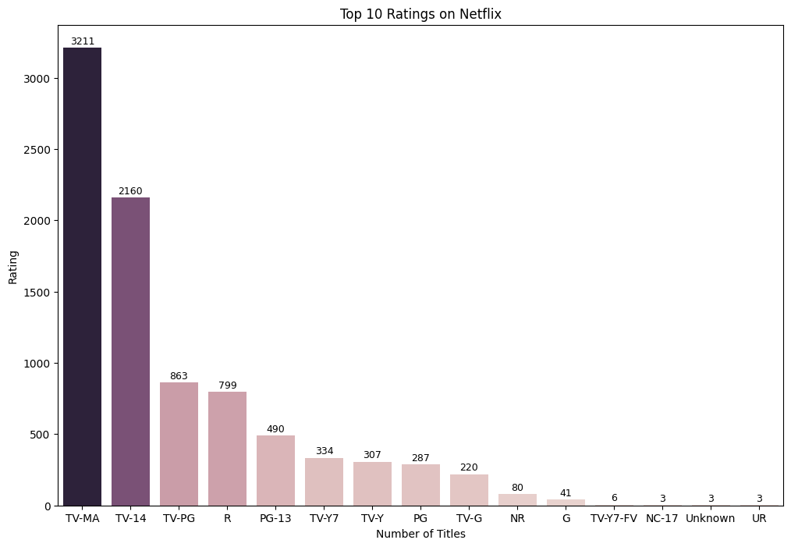

# 📊 Netflix Data Analysis


## 📌 Overview

This project explores and analyzes the **Netflix dataset** to discover trends, patterns, and insights about its content library.  
It uses **Python** for cleaning, analysis, and visualization.  

The aim is to answer questions like:

- Which countries produce the most content on Netflix?
- What is the ratio of Movies vs TV Shows?
- How has Netflix's content library grown over time?
- Which genres dominate the platform?
- Are there seasonal patterns in content addition?

---

## 🗂 Dataset

- **Source:** [Netflix Dataset on Kaggle](https://www.kaggle.com/shivamb/netflix-shows) *(or replace with your source)*  
- **Format:** CSV file containing:
  - Title  
  - Director  
  - Cast  
  - Country  
  - Release Year  
  - Date Added  
  - Rating  
  - Duration  
  - Genre/Listed In

---

## 🛠 Tools & Libraries

- **Language:** Python 3
- **Libraries:**
  - `pandas` – Data cleaning & manipulation
  - `numpy` – Numerical operations
  - `matplotlib` – Visualization
  - `seaborn` – Statistical plots

---

## 📈 Key Insights

### 1️⃣ Content Type Distribution  

  

### 2️⃣ Top 10 Countries with Most Titles  

  

### 3️⃣ Trend of Content Over Years  

  

### 4️⃣ Rating Distribution  

  

---

## 🚀 How to Run

1. Clone the repository:

```bash
git clone https://github.com/dixitaBalapuriy19/Netflix-Data-analysis.git
```
   

---

## Author

Dixita Balapuriya
Email: <dixitabalapuriya@gmail.com>
      <balapuriyad@gmail.com>
Github: <https://github.com/dixitaBalapuriya19>
